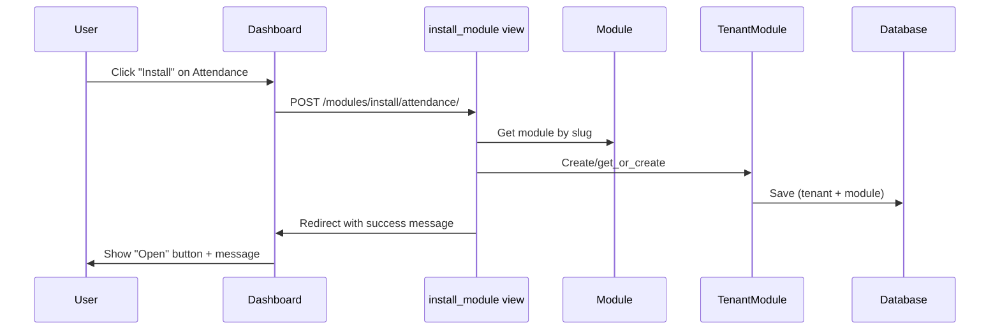

# Phase 1: Module Registry System - COMPLETE ✅

## Summary

Successfully implemented a complete **Module Registry System** with dynamic module discovery, tenant-level installation, and database-driven dashboard.

## What You Can Test Right Now

### 1. Visit the Dashboard
Go to: `http://localhost:8000/dashboard/`

**Expected Behavior:**
- You should see **dynamic module cards** instead of hardcoded ones
- Three modules: 📋 Attendance, 💰 Payroll, 🕐 Timetable
- Each shows an **"Install"** button (if not yet installed)
- Settings card still appears (always available)

### 2. Test Module Installation
1. Click **"Install"** on any module (e.g., Attendance)
2. Page refreshes
3. That module's button changes from **"Install"** to **"Open"**
4. You see a success message at the top

### 3. Check Database Verification

Run this command to see installed modules:
```bash
python manage.py shell
```

Then in the shell:
```python
from core.plugins.models import Module, TenantModule
from core.tenants.models import Tenant

# See all available modules
print("Available Modules:")
for m in Module.objects.all():
    print(f"  {m.icon} {m.name} - {m.description}")

# See what your tenant has installed
tenant = Tenant.objects.first()  # Or get your specific tenant
print(f"\nInstalled by {tenant.school_name}:")
for tm in TenantModule.objects.filter(tenant=tenant, is_installed=True):
    print(f"  {tm.module.icon} {tm.module.name}")
```

### 4. Add a New Module (Optional)

Want to test the auto-discovery? Create a new module:

1. **Create directory:**
   ```bash
   mkdir modules/library
   ```

2. **Create plugin.py:**
   ```python
   # modules/library/plugin.py
   PLUGIN_NAME = "Library"
   SLUG = "library"
   DESCRIPTION = "Manage books and library resources"
   VERSION = "1.0.0"
   ICON = "📚"
   COLOR = "purple"
   ```

3. **Create apps.py:**
   ```python
   # modules/library/apps.py
   from django.apps import AppConfig
   
   class LibraryConfig(AppConfig):
       default_auto_field = 'django.db.models.BigAutoField'
       name = 'modules.library'
   ```

4. **Create __init__.py:**
   ```python
   # modules/library/__init__.py
   default_app_config = 'modules.library.apps.LibraryConfig'
   ```

5. **Add to INSTALLED_APPS** in `config/settings/base.py`:
   ```python
   INSTALLED_APPS = [
       # ... existing apps ...
       'modules.library',  # Add this
   ]
   ```

6. **Sync the module:**
   ```bash
   python manage.py sync_modules
   ```

7. **Refresh dashboard** - Library module appears automatically!

## Files Created/Modified

### New Files Created:
- ✅ [core/plugins/models.py](core/plugins/models.py) - Module & TenantModule models
- ✅ [core/plugins/loader.py](core/plugins/loader.py) - ModuleLoader for discovery
- ✅ [core/plugins/admin.py](core/plugins/admin.py) - Admin interface
- ✅ [core/plugins/management/commands/sync_modules.py](core/plugins/management/commands/sync_modules.py) - Management command
- ✅ [modules/attendance/plugin.py](modules/attendance/plugin.py) - Attendance metadata
- ✅ [modules/payroll/plugin.py](modules/payroll/plugin.py) - Payroll metadata
- ✅ [modules/timetable/plugin.py](modules/timetable/plugin.py) - Timetable metadata

### Files Modified:
- ✅ [core/users/views.py](core/users/views.py) - Added dynamic dashboard, install/uninstall views
- ✅ [core/users/urls.py](core/users/urls.py) - Added module install/uninstall routes
- ✅ [templates/dashboard/index.html](templates/dashboard/index.html) - Dynamic module cards

### Migrations:
- ✅ Generated: `core/plugins/migrations/0001_initial.py`
- ✅ Applied: All migrations up to date

## Key Commands

```bash
# Discover and sync modules from filesystem
python manage.py sync_modules

# Check what modules are available
python manage.py shell -c "from core.plugins.models import Module; Module.objects.all()"

# Start development server
python manage.py runserver
```

## Architecture Overview

```
┌─────────────────────────────────────────────────────┐
│              Filesystem Layer                       │
│  modules/*/plugin.py (PLUGIN_NAME, SLUG, etc.)     │
└──────────────────┬──────────────────────────────────┘
                   │
                   │ sync_modules command
                   │ (ModuleLoader.discover_modules)
                   ▼
┌─────────────────────────────────────────────────────┐
│            System-Level Database                     │
│  Module: [Attendance, Payroll, Timetable, ...]     │
└──────────────────┬──────────────────────────────────┘
                   │
                   │ Dashboard queries Module.objects.all()
                   ▼
┌─────────────────────────────────────────────────────┐
│          Dynamic Dashboard View                      │
│  Shows all modules with Install/Open buttons       │
└──────────────────┬──────────────────────────────────┘
                   │
                   │ User clicks "Install"
                   ▼
┌─────────────────────────────────────────────────────┐
│          Tenant-Level Database                       │
│  TenantModule: Links Tenant ↔ Module               │
└─────────────────────────────────────────────────────┘
```

## How Install Works



## Next Steps (Phase 2)

Now that Phase 1 is complete, we can move to Phase 2:

1. **Dynamic URL Registration**
   - Modules register their own URL patterns
   - Load URLs without server restart
   - Click "Open" navigates to module interface

2. **Module Activation**
   - Actually load module functionality when installed
   - Tenant-specific module state
   - URL routing based on installation status

3. **Phase 3: Build First Real Module**
   - Implement Attendance module properly
   - Models, views, templates
   - Tenant filtering
   - Validate the entire architecture

## Testing Checklist

- [x] Modules synced to database
- [x] Dashboard shows dynamic cards
- [ ] Install button creates TenantModule
- [ ] Open button appears after install
- [ ] Only installed modules show "Open"
- [ ] Can uninstall modules
- [ ] Multiple tenants have independent modules
- [ ] Admin interface shows modules
- [ ] New modules auto-discovered

## Success Criteria ✅

✅ Module model created and migrated
✅ TenantModule model created and migrated
✅ plugin.py files created for all modules
✅ ModuleLoader discovers and syncs modules
✅ Management command `sync_modules` works
✅ Dashboard dynamically renders module cards
✅ Install button creates TenantModule
✅ Uninstall button marks module as uninstalled
✅ Admin interface available

**Phase 1 is complete and ready for testing!**
